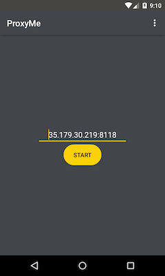
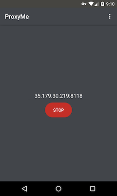
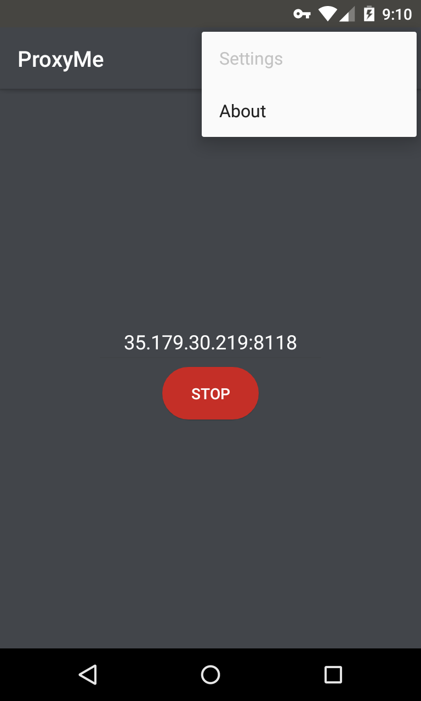
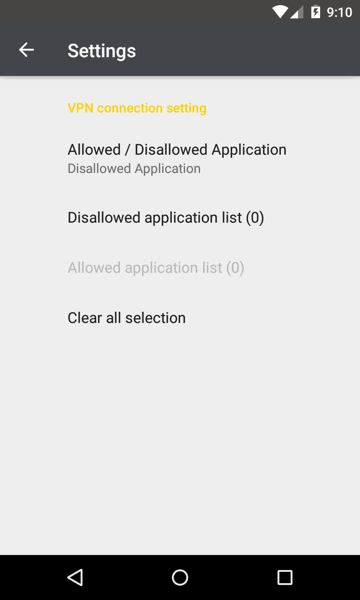

Android HTTP traffic Proxy setting tool
=============

This tool is a proxy configuration tool that takes advantage of Android VPNService feature. 
Only the communication from the specified application can be acquired.

## How to use it

When you start the ProxyMe application, the following screen will be launched.

* Proxy address (ipv4:port)
  * Specify the destination proxy server in the format **IPv4 address:port number**.
    The IP address must be described in IPv4 format.

* [Start] button
  * Start the VPN service.
* [Stop] button
  * Stop the VPN service.

## Menu

Application settings can be made from the menu icon at the top of the screen.

### Settings

Configure VPN service settings.

 ⇒ 

There are two modes, Disallowed Application and Allowed Application, but you can not specify them at the same time.
Because of this you will have to choose whether you want to run in either mode.
The default is **Disallowed Application** selected.

* Disallowed Application
  * Select the application you want to exclude from VPN service.
    The selected application will no longer go through VPN service and behave the same as if you do not use VPN.

* Allowed Application
  * Select the application for which you want to perform VPN service.
    The selected application will now go through VPN service.
    Applications that are not selected behave the same as when not using VPN.
    In addition, if none of them are selected, communication of all applications will go through VPN.

* Clear all selection
  * Clear all selections of Allowed / Disallowed application list.

### About
Display application version

## Operating environment

* Android 5.0 (API Level 21) or later

### Build APK
 gradlew build

## Base Application

Most of the codes were adopted from https://github.com/raise-isayan/TunProxy

## Development environment

* AndroidStudio (https://developer.android.com/studio/index.html)
